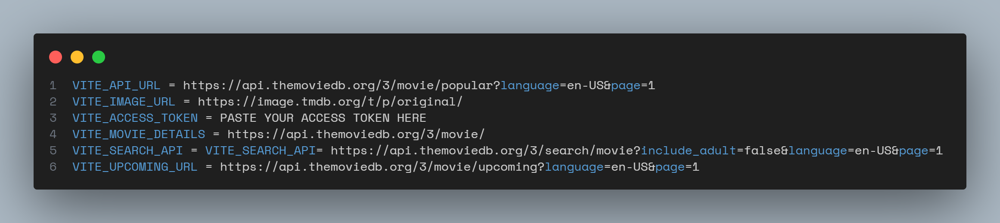

# HNGx Stage 2 Task: MovieBox

A movie discovery web application that allows users to search for movies, view details about them, and save their favorite movies.

# Built with

- React
- Tailwind
- TMDB API

### Setup

1. Open your terminal

2. Clone the GitHub Repository using 'git clone https://github.com/shadrxcc/moviebox-hngx.git'

- Go to the Project Directory 'cd moviebox-hngx'
- Run `npm install` to install dependencies

3. API key setup

- Go to [TMDB](https://developer.themoviedb.org/reference/intro/getting-started)
- Create an account and get your access token under the API section on your account settings.
- Create a .env file in the root directory of your project and create your env variables as shown below. Replace 'Paste your access token' with your access token.

  

4. Run project

- Run `npm run dev`. it runs the app in the development mode. 
  Open http://localhost:5173 to view it in your browser.
